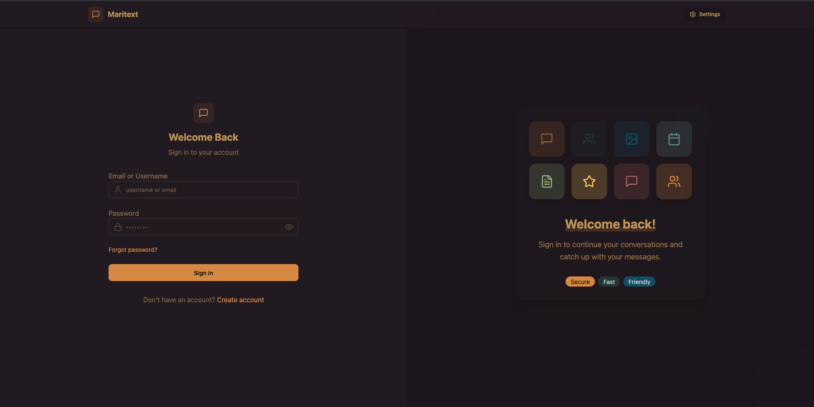
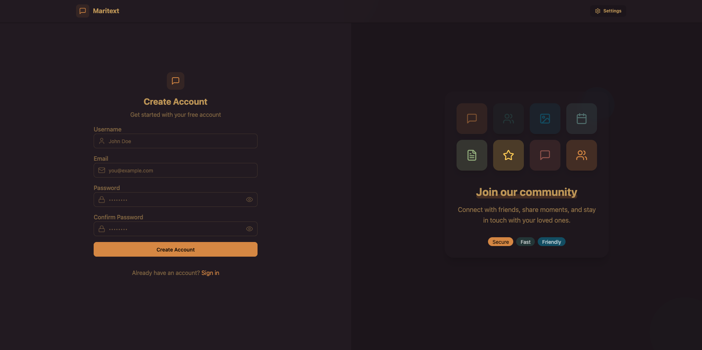
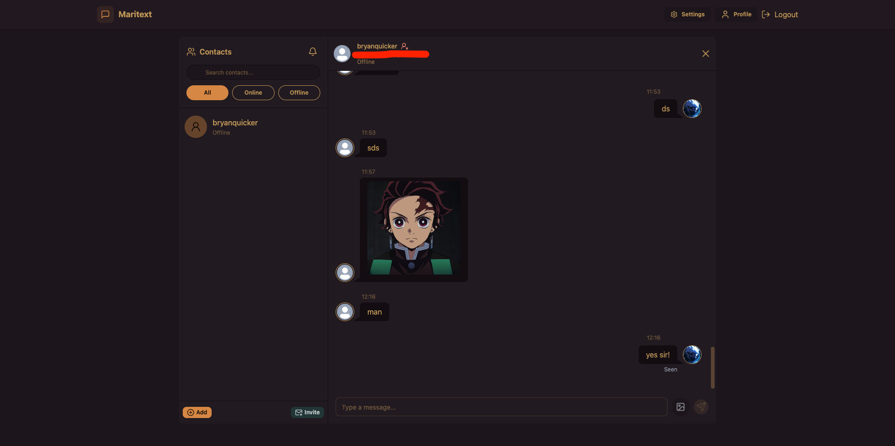
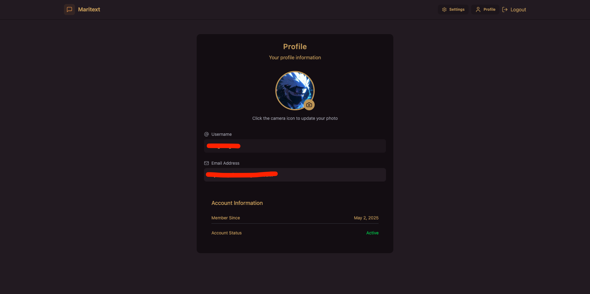
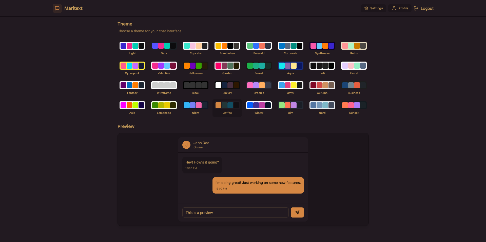

# 💬 Maritext Realtime Chat App

A full-stack real-time chat application built using the **MERN stack** and **Socket.IO**.

> 🔧 Inspired by [MERN Stack Project: Realtime Chat App Tutorial - React.js & Socket.io by Codesistency](https://www.youtube.com/watch?v=ntKkVrQqBYY), then extended with custom features and improvements for a better user experience.

---

## 👤 Users and Roles

**All Users** can:
- Add, accept, reject, and delete contacts  
- Edit profile and username  
- Send messages and images  
- Participate in real-time, private conversations

---

## 🌐 General UI Features

### 1. Responsive Design
- Mobile-first layout optimized for all screen sizes  
- Clean, modern interface with intuitive navigation

### 2. Real-time Interface
- 💬 Live message updates with no refresh needed  
- 👥 Real-time display of online users  
- 🔔 Contact request notifications

### 3. Chat Experience
- ✍️ Clean input with image/message support  
- 🕒 Timestamps with user name visibility  
- 🗂️ Organized message threads per contact

---

## ✨ Features

### 🧱 Base Features from Tutorial
- Real-time communication using Socket.IO  
- User join with display name  
- Active users list in real-time  
- Profile customization  
- Theme toggling

### 🛠️ Custom Features Added
- ✅ Email verification + resend verification option  
- ✅ Forgot password and password reset flow  
- ✅ Contact system (add, accept/reject, delete)  
- ✅ Delivery status: sent, delivered, and seen  
- ✅ Contact filtering and search  
- ✅ Invite a friend feature  
- ✅ Message unsend functionality  
- ✅ "User is typing..." animation  
- ✅ Image modal viewer  
- ✅ Update username option

---

## 🛠 Tech Stack

### Frontend
- React.js  
- Tailwind CSS + DaisyUI  
- Socket.IO Client  
- Mailtrap (for email testing)

### Backend
- Node.js + Express  
- MongoDB with Mongoose (for users, contacts, messages)  
- Socket.IO Server  
- Built-in `path` and `http` modules

### Deployment
- **Render** (Full-stack deployment)

---

## 📸 Screenshots

### 🏁 Signup Page

### 🏁 Login Page

### 💬 Chat Interface

### 📱 Profile View

### 📱 Settings View

---

## 📌 Scope and Limitations

### ✅ Scope
- Real-time messaging via Socket.IO  
- One-to-one room-based chat  
- Contact and user management  
- Persistent message storage in MongoDB  
- Cross-platform and responsive design

### ⚠️ Limitations

#### 🌐 Deployment Constraints
- Hosted on **Render (Free Tier)**:
  - May take 30–60 seconds to wake after inactivity  
  - Limited concurrent users  
  - Occasional cold starts

#### 🔐 Security Considerations
- No end-to-end encryption  
- Basic input validation

#### 📊 Performance Limits
- Ideal for small to mid-sized chat use  
- Lacks advanced message throttling or queuing

---

## 🔐 Security & Data Handling

- Client-side sanitization of input  
- MongoDB for storing messages and users securely  
- Real-time connection management  
- Socket.IO’s built-in transport-layer security

---

## 🌐 Live Demo

🔗 [https://maritext-realtime-chat-app.onrender.com](https://maritext-realtime-chat-app.onrender.com)

> ⚠️ *Note: May experience 30–60s delay if idle due to Render’s free tier limitations.*

---

## 📖 Tutorial Credit

Based on the original tutorial by [Codesistency on YouTube](https://www.youtube.com/watch?v=ntKkVrQqBYY)  
Expanded and customized with additional features by **Bryan Suguitan**

---

## 👤 Author

**Bryan Harold R. Suguitan**  
- GitHub: [@brynsgtn](https://github.com/brynsgtn)  
- Portfolio: *[My Portfolio] (https://brynsgtn-webportfolio.vercel.app/)*  
- Live Demo: [Maritext Realtime Chat](https://maritext-realtime-chat-app.onrender.com)

---

## 🙌 Acknowledgments

Built with 💻, ☕, and persistence by Bryan Suguitan.  
⭐ If you found this project helpful, consider giving it a star!